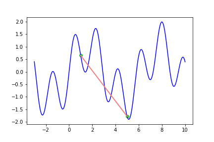
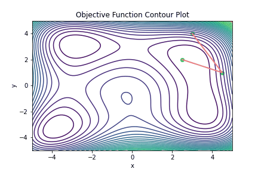

# Nelder-Mead-method_python-version
## Introduction
When dealing with complex multidimensional models or non-differentiable functions, traditional optimization algorithms may face performance degradation or divergence issues. The Nelder-Mead method is designed specifically for multidimensional nonlinear optimization problems, making it well-suited for optimizing parameters of unknown systems.
### Features
**Multidimensional Optimization:** The Nelder-Mead method excels in handling high-dimensional parameter spaces, making it suitable for complex parameter adjustment problems.

**Nonlinear Functions:** Due to its excellent adaptability to nonlinear functions, the Nelder-Mead method is an ideal choice for dealing with non-differentiable functions or highly nonlinear problems.

**Iterative Optimization:** By iteratively optimizing, the method seeks the minimum or maximum of the objective function.
## Requirements
* numpy
* matplotlib
* imageio
* os
## Descriptions
The following is the graphical representation of the contraction action in the Nelder-Mead method.

If you use ```Nelder-Mead-method_test_gif.py```, you will be able to observe the performance of the method on different 1D or 2D functions.




## Usage
By using ```Nelder-Mead-method.py```, you can optimize parameters for an unknown multidimensional function by leveraging command window messages. Additionally, you have the flexibility to alter termination conditions to modify the number of iterations for optimal optimization.

With ```Nelder-Mead-method_test_gif.py```, you can explore different 1D or 2D functions and observe the optimization results for various initial coordinates.
